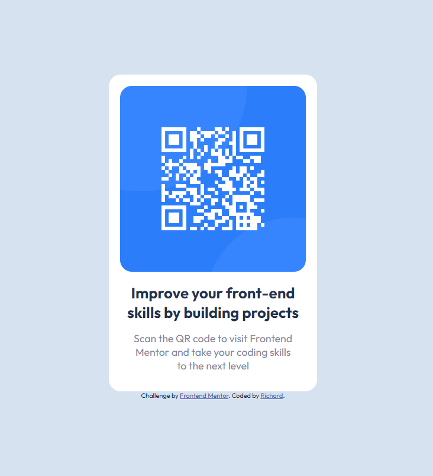

# Frontend Mentor - QR code component solution

This is a solution to the [QR code component challenge on Frontend Mentor](https://www.frontendmentor.io/challenges/qr-code-component-iux_sIO_H). Frontend Mentor challenges help you improve your coding skills by building realistic projects.

## Table of contents

- [Overview](#overview)
  - [Screenshot](#screenshot)
  - [Links](#links)
- [My process](#my-process)
  - [Built with](#built-with)
  - [What I learned](#what-i-learned)
  - [Continued development](#continued-development)
  - [Useful resources](#useful-resources)
- [Author](#author)

**Note: Delete this note and update the table of contents based on what sections you keep.**

## Overview

### Screenshot



### Links

- Solution URL: [Github Link](https://github.com/Joonbie/QR-code-component.git)
- Live Site URL: [Github Pages Link](https://joonbie.github.io/QR-code-component/)

## My process

### Built with

- Semantic HTML5 markup
- CSS custom properties
- Flexbox

### What I learned

Having still been new to html and css, This was a great start for the first challenge.
I learned how to position the card properly and to make the sizing of the card as similar to the design spec that was given.

I feel that the whole challenge process for me was a good learning project to break away from just watching tutorials and building something from scratch instead.

It was also the first time i had to work with the box-shadow tag in css.

```css
.primary-container {
  box-shadow: 0px 0px 10px 10px var(var(--bx-shadow));
}
```

### Useful resources

- [Mozilla Developer Network](https://developer.mozilla.org/en-US/docs/Web/CSS) - This helped me for getting a clearer understanding of what the style tags that have been used.
- [Complete guide to centering in css](https://moderncss.dev/complete-guide-to-centering-in-css/) - This is an amazing article which helped me fully understand how to properly center a div using different ways. I'd recommend it to anyone still learning this concept.

## Author

- Website - [Richard]()
- Frontend Mentor - [@Joonbie](https://www.frontendmentor.io/profile/Joonbie)
